# Finetune Stable Diffusion

base model，e.g.：

```shell
git lfs clone https://huggingface.co/runwayml/stable-diffusion-v1-5
or
git lfs clone https://huggingface.co/runwayml/stable-diffusion-v1-5/tree/fp16
```


# 目录

133

/data/wgs/finetune_stable_diffusion


# Dockerfile

./dk/Dockerfile


# Dreambooth

+ Dreambooth 原理：

[Finetune Stable Diffusion: Dreambooth](https://mp.weixin.qq.com/s?__biz=Mzk0MzIzODM5MA==&mid=2247486522&idx=1&sn=0db6a55c5778690cf7088e2b99140af6&chksm=c337b1a3f44038b5f54d0ec216d09717367ef4d1b9830a8fd1d4211c90410324448b4c3f9179#rd)

+ 微调运行：

```shell
sh ./dk/train.sh dreambooth
```

+ 推理运行：

```shell
  base_model = './weights/sd1-5_dreambooth/'
  
  docker run --rm -it -d --gpus '"device=3"' --name inference_diff\
                   -v /data/wgs/finetune_stable_diffusion:/home \
                   wgs-torch:control_diffusion \
                   sh -c "python -u /home/inference.py 1>>/home/log/inference.log 2>>/home/log/inference.err"
```

+ 脚本参数说明：

```shell
--MODEL_NAME：base model
--INSTANCE_DIR：微调数据集
--CLASS_DIR：用以先验损失的图像，通常为 num_epochs * num_samples ，num_class_images设置生成的数量，通常200-300
--OUTPUT_DIR：模型输出路径
--with_prior_preservation，--prior_loss_weight=1.0：分别是使用先验知识保留和先验损失权重
# 如果你的数据样本比较少，那么可以使用这两个参数，可以提升训练效果，还可以防止过拟合（即生成的图片与训练的图片相似度过高）
--instance_prompt：微调注入新的概念prompt（注意，e.g.：kejisks dog）
--class_prompt：先验prompt，使用同一类的其他图像作为训练过程的一部分（注意，e.g.：dog）
--revision：精度
--mixed_precision：混合精度
--resolution：input feature map size
--gradient_accumulation_steps：梯度积累步骤
----lr_scheduler：可选项有constant, linear, cosine, cosine_with_restarts, cosine_with_hard_restarts
# 学习率调整策略，一般是constant，即不调整
--lr_warmup_steps，如果你使用的是constant，那么这个参数可以忽略，
# 如果使用其他的，那么这个参数可以设置为0，即不使用warmup
# 也可以设置为其他的值，比如1000，即在前1000个step中，学习率从0慢慢增加到learning_rate的值
# 一般不需要设置, 除非你的数据集很大，训练收敛很慢
--num_class_images：调用模型生成图像，提示词为 class_prompt，保存位置为 CLASS_DIR
--max_train_steps：训练的最大步数 max_train_steps  e.g.: len(imgs) * 100
--checkpointing_steps：多少steps保存ckpt
--use_8bit_adam：使用8bit
--enable_xformers_memory_efficient_attention：使用xformers
```


## 微调效果测试

测试：注入概念【柯基犬 --> kejisks】

+ `instance_prompt="kejisks dog"`

+ `class_prompt="dog"`

```
prompt = "a photo of kejisks dog"
```

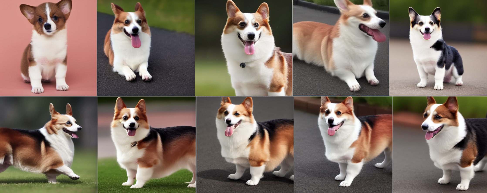

```
prompt = "a photo of dog"
```

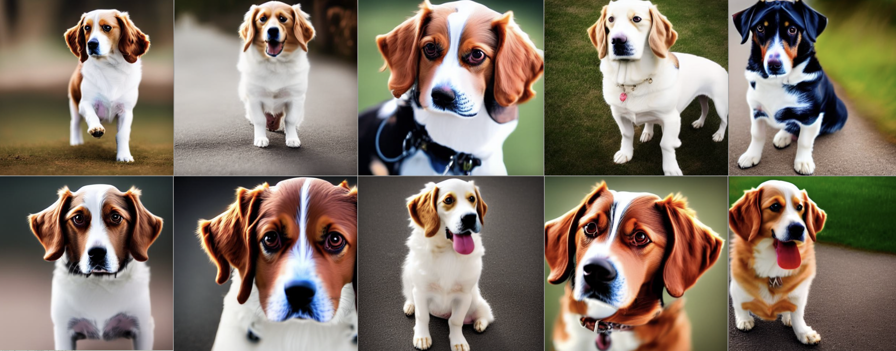

## 融入其它语境测试

```
prompt = "A kejisks dog with Eiffel Tower in the background"
```

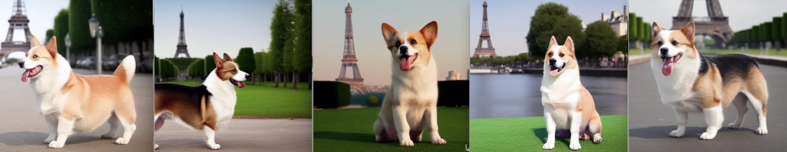

```
prompt = "A kejisks dog in the mountain Fuji"
```

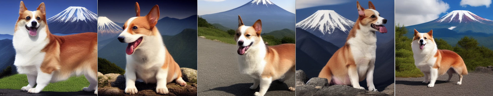

```
prompt = "There's a kejisks dog on the beach"
```

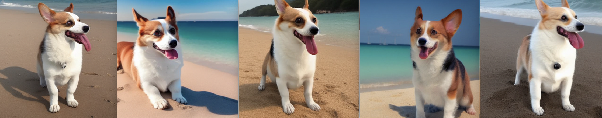

```
prompt = "A kejisks dog in the woods"
```

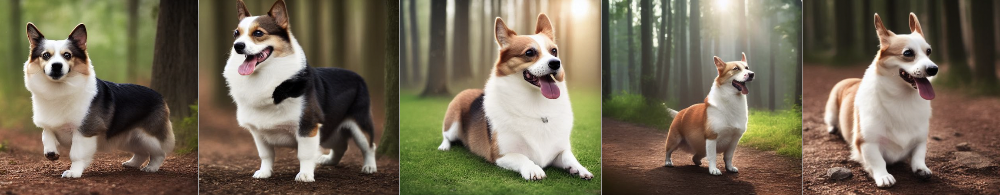

```
prompt = "A kejisks dog in the car"
```

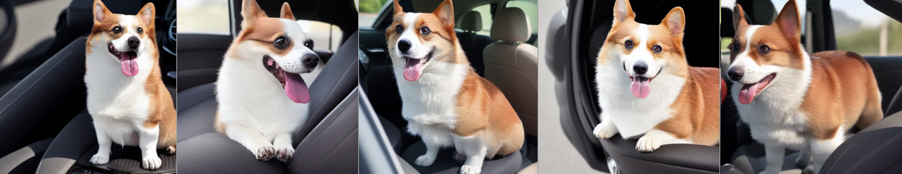

```
prompt = "The kejisks dog is running in the water"
```

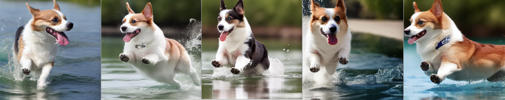

```
prompt = "A kejisks dog is playing with a yellow ball on the lawn"
```

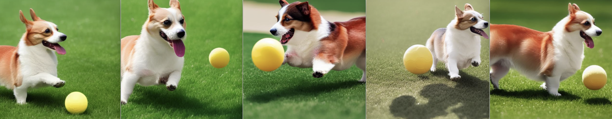

```
prompt = "A kejisks dog with glasses"
```

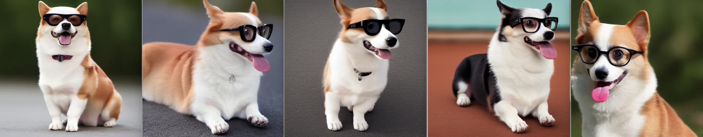

```
prompt = "The child of a kejisks dog and a tiger"
```

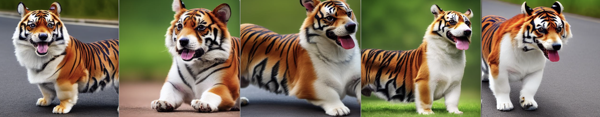

```
prompt = "A kejisks dog is smile on the snowstorm"
```

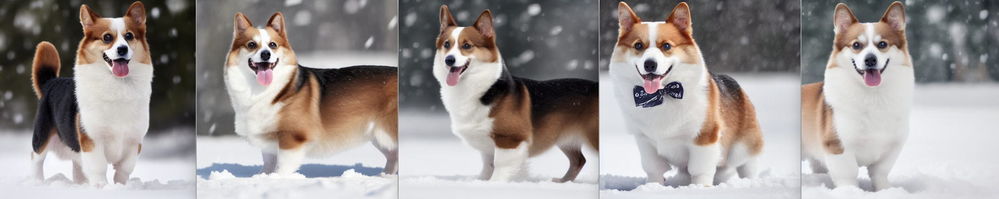


## 通用能力测试

```
prompts = ['heavy traffic on the street', 
					 "Cute squirrel", 
					 "Church in the snow",
           "Ancient style moon lantern flower tree", 
           "Chicken in the woods", 
           "The worker under the umbrella"]
```


## 显存占用

+ float16 + mixed precision
+ 8bit
+ xformers

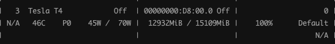

```
Steps: 100%|██████████| 800/800 [15:54<00:00,  1.19s/it, loss=0.272, lr=1e-6]
```


## 测试中遇到的问题

+ 结论先行：

1. 只是更换新注入主题的背景，效果还可以，上述图例可证；
2. 要对新注入主题本身进行合成，效果不理想，下述图例可证；
3. 如果该主题对应类的合成效果不好，则该主题合成效果也不好，下述图例可证；

+ 原因分析：

1. base model 学到的先验知识不足以与新注入的主题合成我们想要的东西；
2. 对该主题过拟合，不足以泛化合成到我的想要的东西；
3. 如果该主题的训练样本数不足，模型没有学到该主题的多样性知识，不能很好的与先验知识合成；

+ 可尝试方案：

1. 对于 1.：更换baseline；
2. 对于 2. 3.：丰富该主题训练样本的多样性、合适的steps及lr、dreambooth+Lora； 

测试出现问题e.g.：

```
prompts = ["A kejisks dog chewing on a bone", 
					 "A dog chewing on a bone"]
```

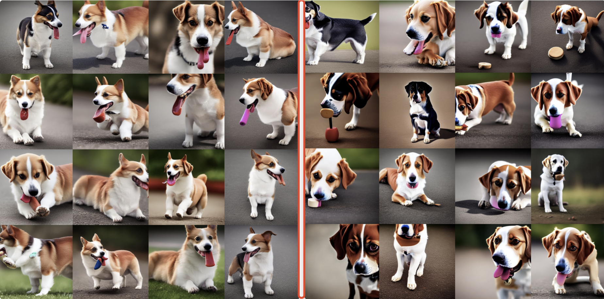

```
prompts = ["A kejisks dog with a helmet and a cape", 
					 "A dog with a helmet and a cape"]
```

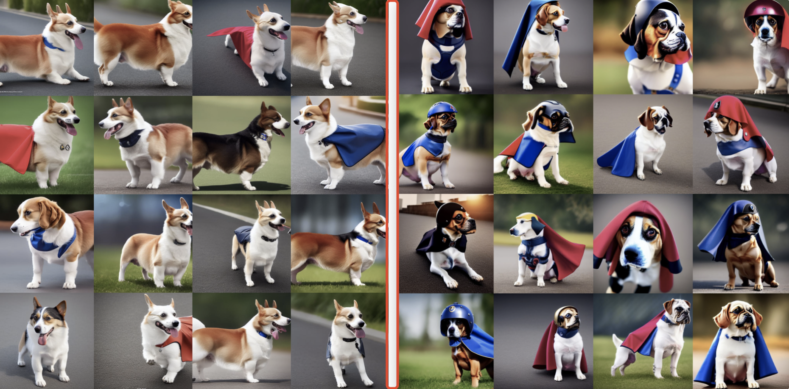

```
prompt = ["A kejisks dog is diving", 
          "A dog is diving"]
```

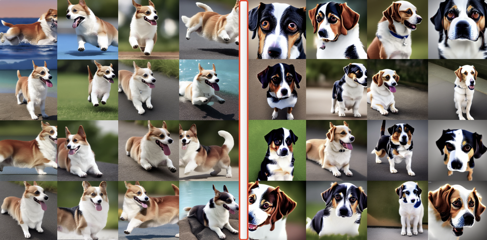


# LoRA

+ LoRA 原理

[Finetune LLMs: LoRA](https://mp.weixin.qq.com/s?__biz=Mzk0MzIzODM5MA==&mid=2247486577&idx=1&sn=281bf0e30b146a8d924cd1ea5d648b99&chksm=c337b1e8f44038feddaaa1a996026109eb728b0912dea9a3c3b9a013a1670eb7a0a98dddcef9#rd)

+ 微调运行

```shell
sh ./dk/train.sh lora
```

+ 推理运行

```python
base_model = './stable-diffusion-v1-5/'
lora_path = './weights/sd1-5_lora/'

docker run --rm -it -d --gpus '"device=3"' --name inference_diff\
                   -v /data/wgs/finetune_stable_diffusion:/home \
                   wgs-torch:control_diffusion \
                   sh -c "python -u /home/inference.py 1>>/home/log/inference.log 2>>/home/log/inference.err" 
```


##微调效果测试

+ 训练 prompt：

```
Yang Mi
summer palace in spring
A good-looking girl in the virtual world
Zibo Barbecue
```

+ 原始效果：

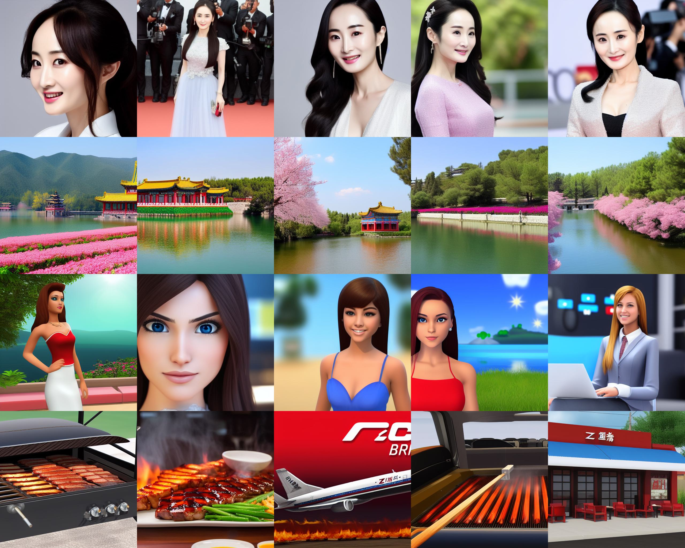

+ 微调效果：

```
prompt = "Yang Mi"
# 学习人物需要更多的、多角度的清晰样本及epoch
```

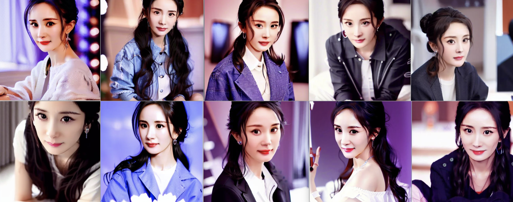

```
prompt = "summer palace in spring"
# 样本质量和数量、epoch要多，佛香阁的细节才能学得更好。不过这前景都学到了确实是我没想到的。
```


```
prompt = "A good-looking girl in the virtual world"
# 我直接在C站上找的样本，图片质量高模型学的也好。
```

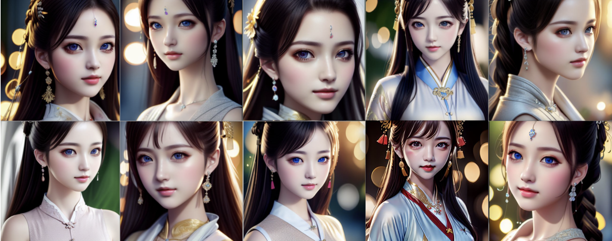

```
prompt = "Zibo Barbecue"
# 网友上传的照片都太杂了，有的还比较模糊，能学成这样已经不错了
```


## 通用能力测试

```
prompts = ['heavy traffic on the street', 
					 "Cute squirrel", 
					 "Church in the snow",
           "Ancient style moon lantern flower tree", 
           "Chicken in the woods", 
           "The worker under the umbrella"]
```


## 显存占用

+ 微调后 LoRA 的权重大小仅 3.2M；

+ “虚拟女孩”、“淄博烧烤” 训练：
  + batch_size=1
  + mixed precision fp16
  + 梯度累积=4
  + epoch=2000

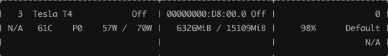


```
Steps: 100%|██████████| 58000/58000 [43:45:04<00:00,  2.72s/it, lr=8.54e-5, step_loss=0.467]
```

+ “杨幂”、“颐和园” 训练：
  + batch_size=1
  + mixed precision fp16
  + 梯度累积=4
  + epoch=3000


```
Steps: 100%|██████████| 78000/78000 [60:10:59<00:00,  2.78s/it, lr=8.54e-5, step_loss=0.494]
```


## 测试中遇到的问题

如果训练人物，应该：

+ 像素质量高；
+ 脸部最好无遮挡；
+ 多角度照片，侧脸、本身、全身；；
+ 样本量多；

我在网上找到杨幂，不是特别清楚，所以学起来需要更多的epoch和样本量，否则脸部会变形：

> 这些是20张杨幂的图片，epoch是2000的结果。上面的例子是50张杨幂照片、epoch是3000的结果，效果挺明显的。

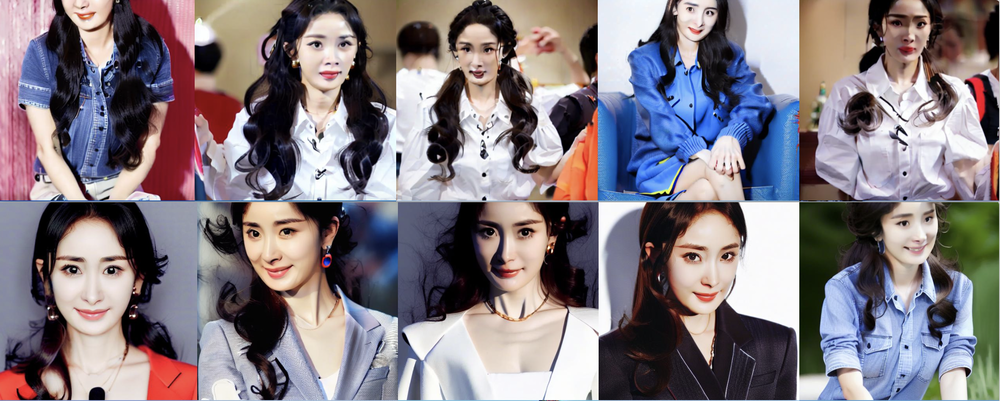

如果训练风景：

+ 像素质量高；
+ 长焦照片必须要清楚、且样本量要多；
+ 照片要聚焦到想要生成的风景上；
+ 样本量多；

我在网上找的颐和园，也有一些不是很清楚的，长焦下的佛香阁背景虚化明显，导致学习效果不好，想要生成佛香阁+昆明湖的照片的话，需要更多的佛香阁样本量，否则佛香阁就不是很清楚：


# Dreambooth + LoRA


# ControlNet


# Tools

+ 如果有 torch 和 torchvision 版本不匹配，参考：https://pytorch.org/get-started/previous-versions/
+ Error caught was: No module named 'triton'，参考：https://blog.csdn.net/qq_42363032/article/details/130006537
+ 


